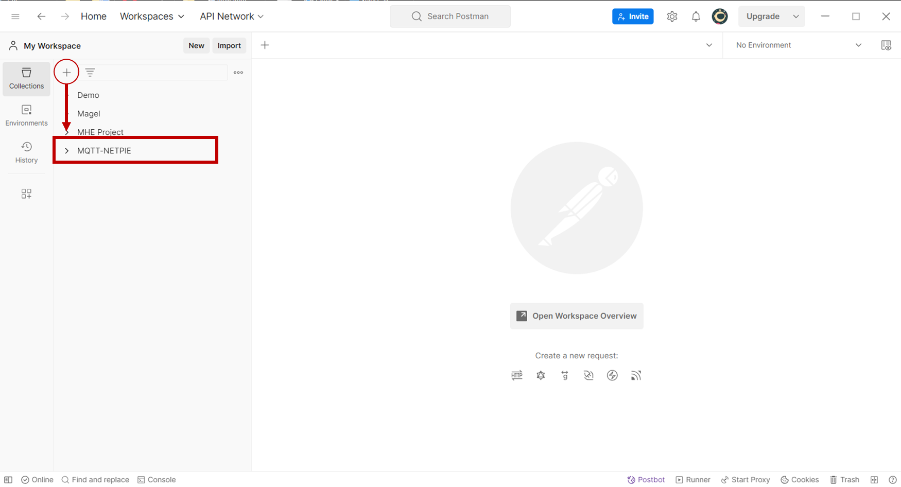
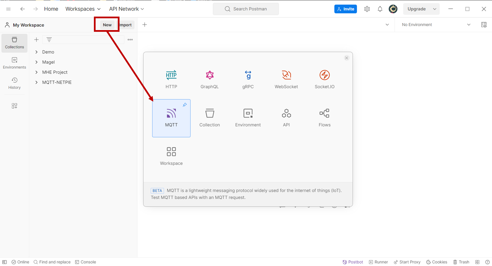
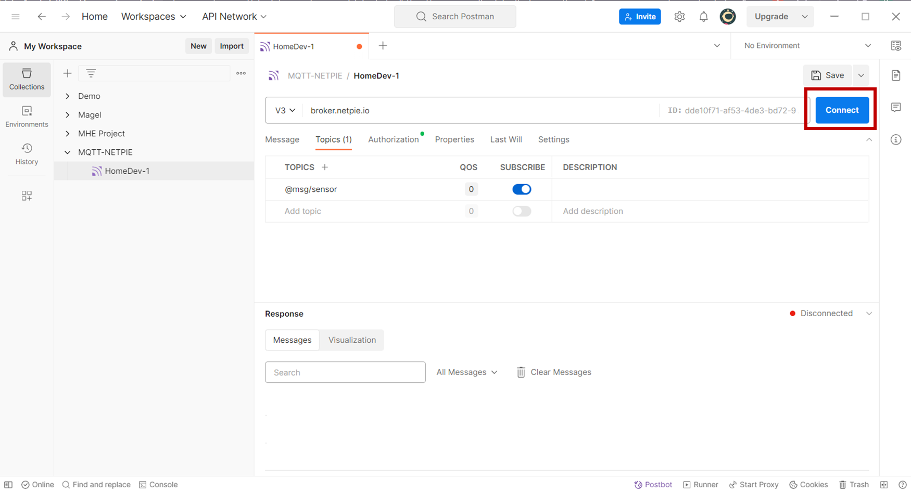
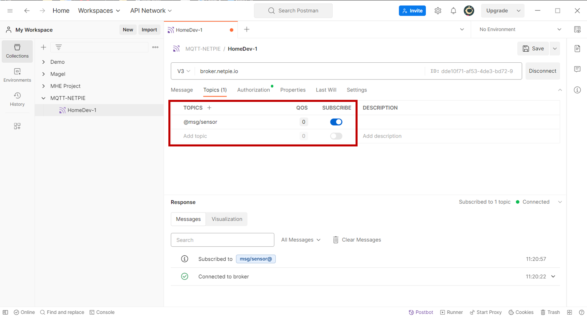
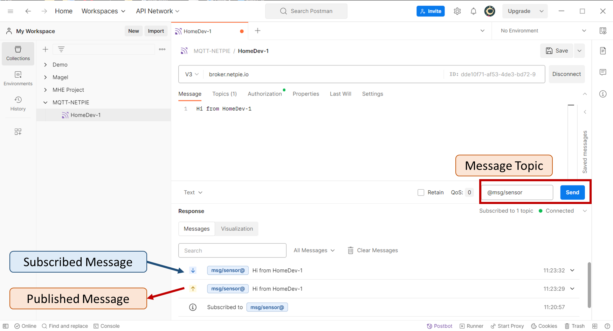

# Postman Tool Guideline for MQTT Connection
This is Tutorial for Hands-on Experiments of 2102541 IoT Fundamentals

Class Instructors:
- Dr Chaodit Aswakul (https://ee.eng.chula.ac.th/chaodit-aswakul/)
- Dr Wanchalerm Pora (https://ee.eng.chula.ac.th/wanchalerm-pora/)

Department of Electrical Engineering, Faculty of Engineering

Chulalongkorn University, Thailand

This tutorial was created by Patchapong Kulthumrongkul 6670165121@student.chula.ac.th
(10 January 2024)

------------------------------------

Postman is an API platform for building and using APIs (ref: https://www.postman.com/). Moreover, Postman also has the service for MQTT connection which we are going to use to connect to NETPIE instead of using MQTTBox. 

## Postman Installation
Go to https://www.postman.com/downloads/. Download the installer corresponding to your local OS and install it

## Examples of connecting MQTT via Postman
After installation is done, launch the Postman and create new **Blank Collection** to store the lists of MQTT requests
In this example, we create the collection named "MQTT-NETPIE"

Next, we are going to add a new MQTT request

Likewise in **MQTTBox**, we need to specify the required configuration information including MQTT Version, Host, Client ID, and Token in order to connect to the instance in the Host. 

Before we are going to connect to the Host, let's save the request to "MQTT-NETPIE" collection so that you can use this request later. 
In this example, we save the request named "HomeDev-1"

Connect to NETPIE

If everything is fine, you should see the status labeled as **connected**

Now we are going to **subscribe** to the topic "@msg/sensor". The response should show "Subscribe to [Your Topic]"

Next we are going to **publish** a message to the topic "@msg/sensor". You should see the response stating that the published message is published and the subscribed message is received

## Try it by yourself
You should try add new requests and connect to more than one instances in NETPIE to see how those instances communicate to each other.
